# Outlook Add-in

## Description

Ce projet est un complément Outlook permettant d'afficher une liste de foyers activable depuis la fenêtre de saisie de rendez-vous. Il utilise TypeScript, Webpack et les API Office.js

## Installation

### Prérequis

- node.js
- npm
- outlook installé
- certificats de développement pour `.office-addin-dev-certs`

### Installation des certificats pour exécuter le complément en local

exécutez la commande suivante dans votre terminal :

```bash
npx office-addin-dev-certs install
```

vérifiez l'installation :

Les fichiers `ca.crt`,`localhost.crt` et `localhost.key` seront créés dans le dossier suivant:

```
C:\Users\%USERPROFILE%\.office-addin-dev-certs
```

comme ceci :
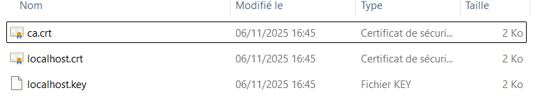

### Étapes

1. Clonez le dépôt :

2. Installez les dépendances :
   ```bash
   npm install
   ```
3. Build le projet
   ```bash
   npm run build
   ```

## Charger et déployer le complément à une ou plusieurs personnes dans outlook web https://outlook.office.com/ (version intégrée dans l'abonnement à la suite Microsoft 365)

Dans les Paramètres allez dans l'onglet "Integrated apps"
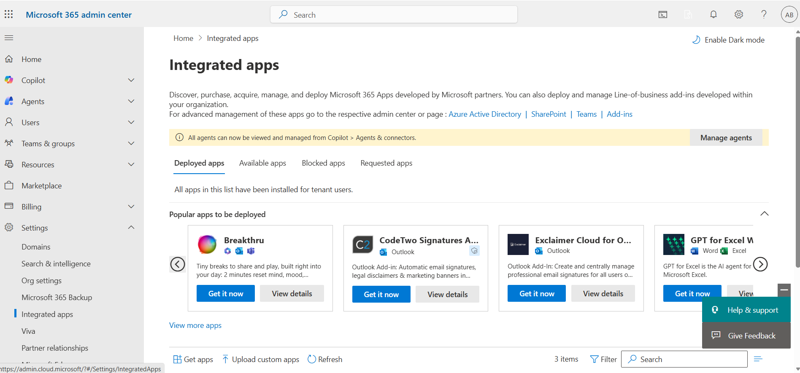

cliquez sur "Upload custom apps", puis séléctionnez "Office Add-in" , déposez le fichier xml
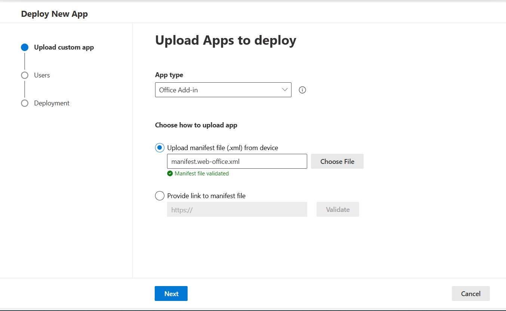

Déployer le à vous même , à votre organisation , ou à des utilisateurs spécifiques
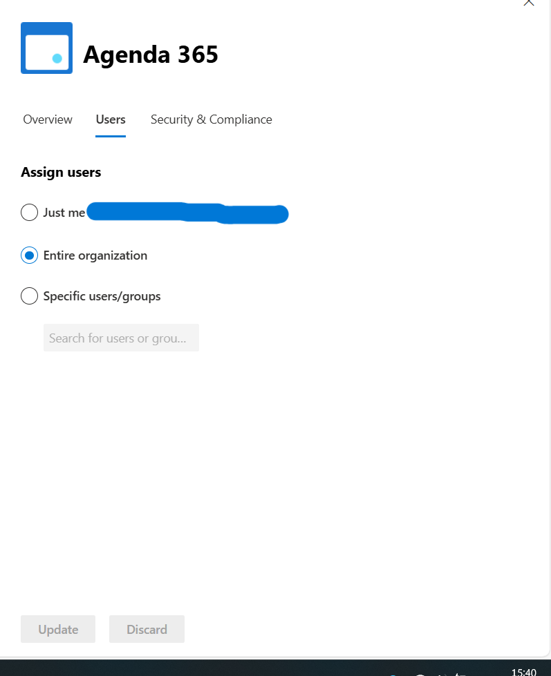

veillez à ce que le host product soit outlook , le complément est à présent créé
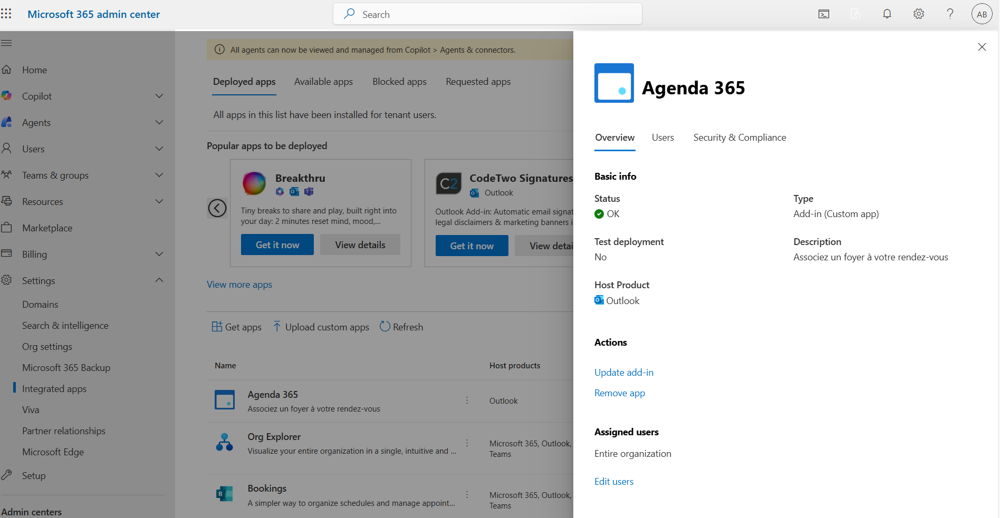

le complément sera déployé dans outlook au bout d'un certain délai
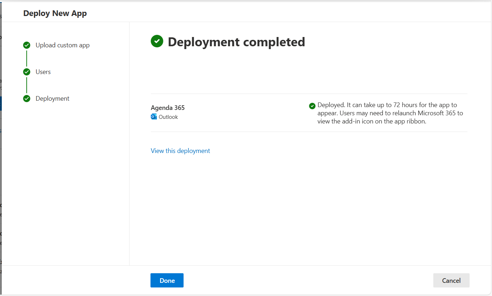

## Charger le complément dans outlook web https://outlook.live.com/ (version indépendante et gratuite)

cliquez sur le bouton "Plus d'applications"dans le "ruban"
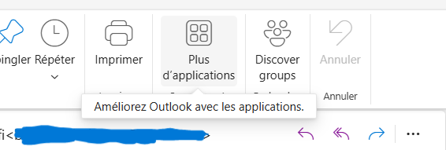

cliquez sur télécharger des compléments
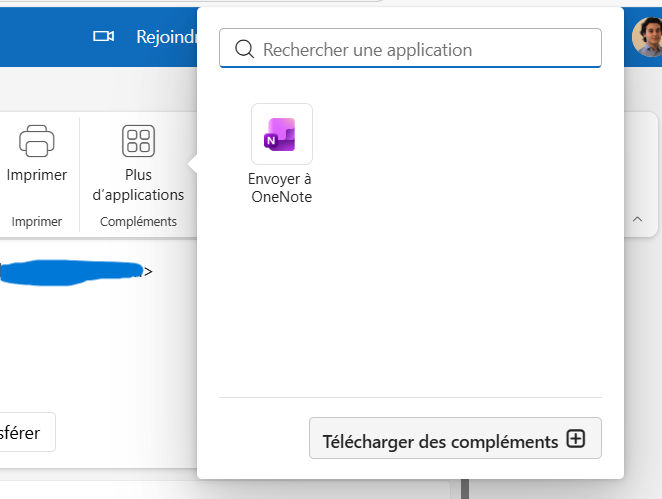

Allez dans l'onglet "Mes compléments" puis ajouter dans "Ajouter un complément personnalisé" , sélectionnez l'ajout à partir d'un fichier
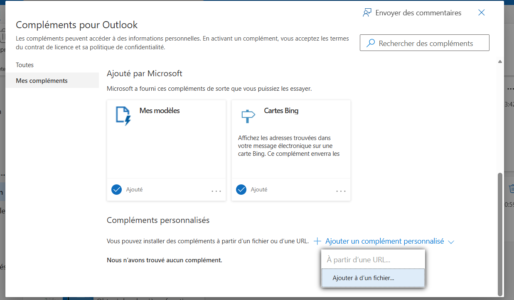

Selectionnez le .xml web
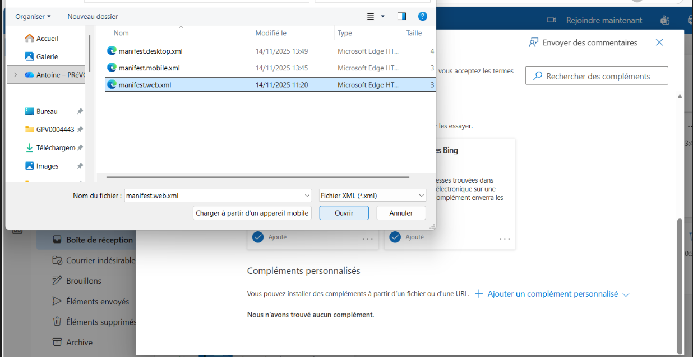

le complément est à présent chargé
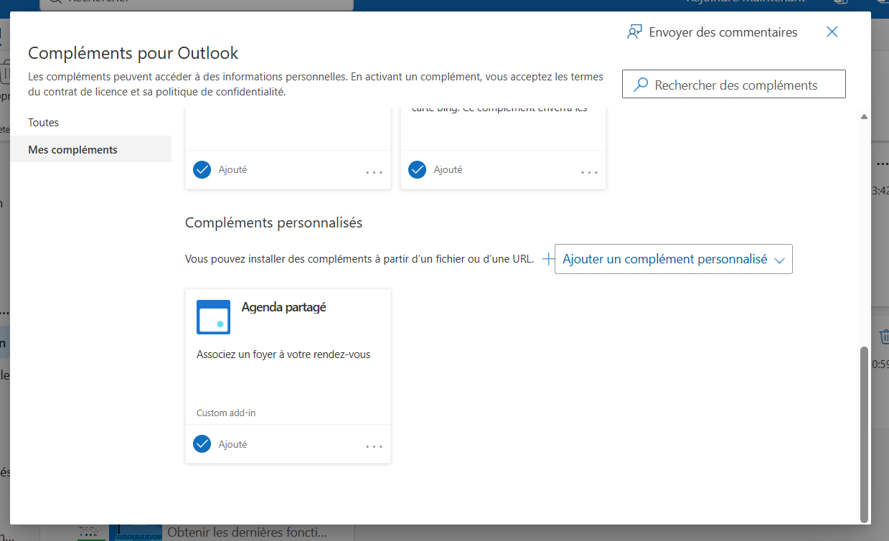

## Développement local

Serveur HTTPS local :

```bash
npm run serve
```

### Vider le cache d'Outlook

Si les modifications ne sont pas prises en compte, vous pouvez vider le cache d'Outlook avec les commandes suivantes :

1. accédez au dossier de cache :

```bash
cd $env:LOCALAPPDATA\Microsoft\Office\16.0\Wef
```

2. supprimez tout le contenu du dossier :

```bash
Remove-Item * -Recurse -Force
```

relancez Outlook après avoir vidé le cache pour voir les modifications
